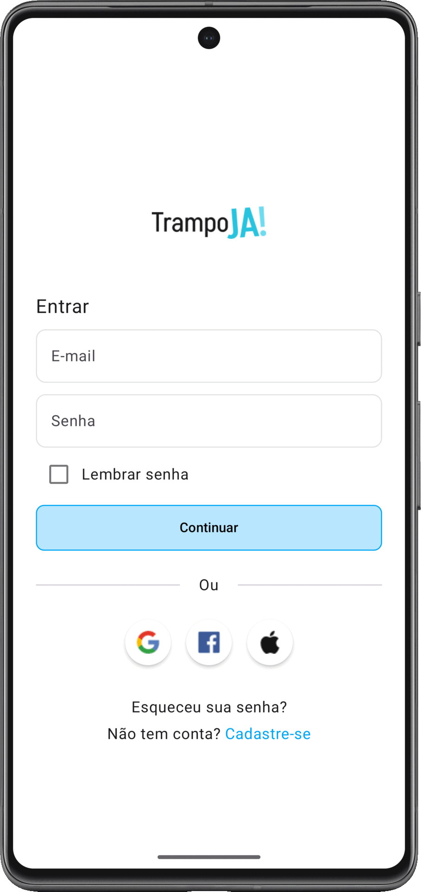

<h1>TrampoJA!</h1>

 <strong>TrampoJA!</strong> is an <strong>Android MVP app focused on social inclusion in the job market</strong>.  
The platform connects vulnerable populations to <strong>affirmative job opportunities</strong>, fostering **diversity, equity, and access** while aligning with **ESG principles**.  

The project was developed in **Kotlin with Jetpack Compose**, consuming the **Adzuna Jobs API**, and integrates modern Android components with a clean and modularized architecture.  
It also includes Figma prototypes and UI wireframes for the entire navigation flow.

---

## Built with

---

## Sections

  

 

- [x] **Authentication**
  - [ ] Login
  - [ ] Register

- [x] **Job Feed**
  - [ ] Explore job opportunities
  - [ ] Search with filters
  - [ ] Save favorite jobs

- [x] **User**
  - [ ] Profile with inclusion attributes
  - [ ] Settings

---

## Contributing

If you have a suggestion that would make this better, please fork the repo and create a pull request.

1. Fork the Project  
2. Create your Feature Branch (`git checkout -b feature/newFeature`)  
3. Commit your Changes (`git commit -m 'Add some cool things'`)  
4. Push to the Branch (`git push origin feature/newFeature`)  
5. Open a Pull Request  

(<a href="#readme-top">^</a>)

---

## Contact

